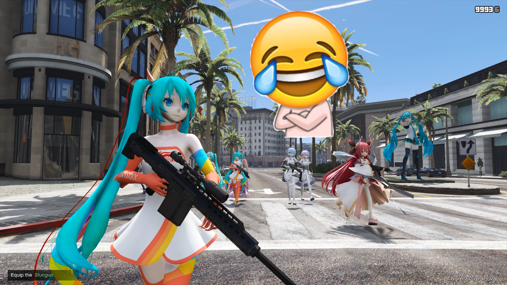

# GTA5-WaifuGuards

Anime girls as your body guards in GTA5 game



## Install

Just copy ``WaifuGuards.dll`` to your GTAV ``scripts`` folder, like:
> &lt;GTAV>/scripts/WaifuGuards.dll

## Shortcut keys

When playing your game, you can:

+ Press ``Y``: for spawn a random waifu ped
+ Press ``U``: for union all of your waifus to guard your character
+ Press ``E``: for call the latest waifu enter your car if you are in a vehicle.
+ Press ``<numpad> 9``: for spawn 10 waifus.

## Custom model

If you wan spawn a given list of ped model, you can write the model name in a text file line by line in format like:

```
model1
model2
model3
...
```

And then save this text file to the same location of the file ``WaifuGuards.dll`` with file name ``waifus.txt``, in a location like:
> &lt;GTAV>/scripts/waifus.txt

## Requirement

+ Latest scripthookvdotnet: https://www.gta5-mods.com/tools/scripthookv-net
+ Waifus Mega Pack(optional): https://zh.gta5-mods.com/player/lolis-and-waifus-mega-pack-blz

## A Known Bug

Due to the reason of ``scripthookvdotnet`` have a known bug that scripts' peds relation group hash native function call is conflicts with the [Enhanced Native Trainer](https://www.gta5-mods.com/scripts/enhanced-native-trainer): there is some settings from the ``Enhanced Native Trainer`` will caused your guard relationship broken. So if you have found your guard start to attack you or killing each other, please ``Reset All Settings`` in ``Enhanced Native Trainer`` at first, this operation will resolve the bug.
