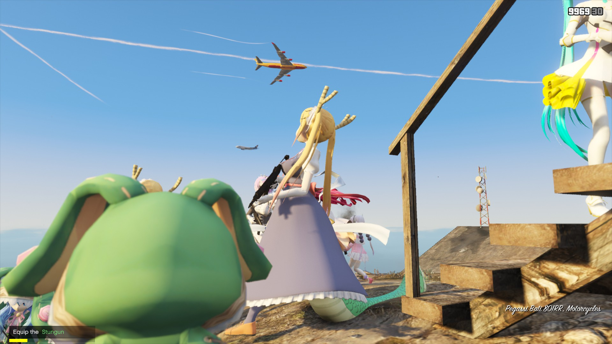
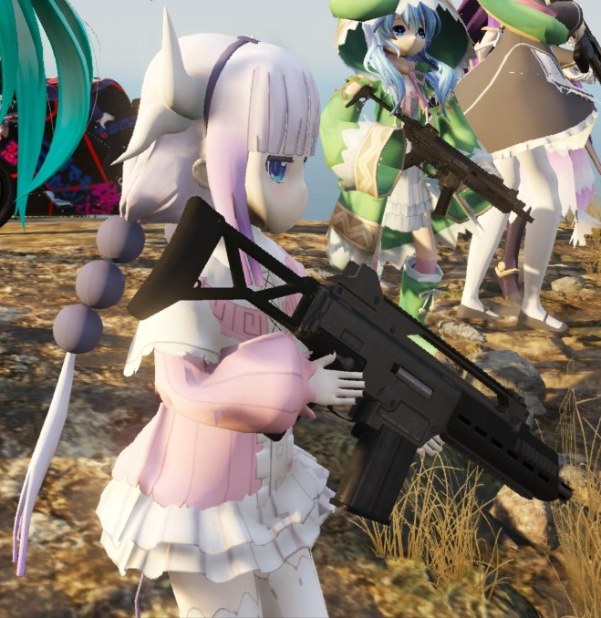

# GTA5 WaifuGuards

This GTAV game mod is an open source project, where you can download this project source code from:
> https://github.com/amethyst-asuka/GTA5-WaifuGuards


> Anime girls as your body guards in GTA5 game

Thanks to the original works of ``crosire``'s [scripthookvdotnet](https://github.com/crosire/scripthookvdotnet), so that we can write our own GTAV script for fun in any .NET language. This post is a tutorial for writing GTAV game script in VisualBasic language. 

Here I trying to explain how to spawn a custom model as your bodyguard to makes your gaming have more fun.

## How to spawn a Ped

```vbnet
Dim waifu As Ped = World.CreatePed(New Model(name), pos)
```

For create a ped, you can using the ``World.CreatePed`` function. The ``World.CreatePed`` function required at least two parameter value: ped's model and its location in the game world. Where the peds' model can be constructed from the model name, and this model name can be customized model which is imported by using ``AddonPeds Editor`` GTAV mod.


> You can using the ``AddonPeds Editor`` for imports your custom player skin as your waifu guards model.

So, if you want spawn a **2016ver Racing Miku**, then you can using the code like:

```vbnet
Dim miku2016 As Ped = World.CreatePed(New Model("miku2016"), pos)
```

A miku should be created and positioning to a given location.


## Make the Ped as your Guard

The new created ped just a normal ped, have no relation with your character, so that you must create some connection to this new ped, so that you can have a new waifu. Create such connection just very easy:

```vbnet
' Just assign her relationship group to yours
waifu.RelationshipGroup = Game.Player.Character.RelationshipGroup
```

As you can see, now your waifu is at the same page with your character, so that any ped trying to fight with your character, your waifu will fight back yo your enemy. This means your waifu now is your bodyguard, she will protect you in any time.

## Makes your waifus following you

A bodyguard means always nearby your current position, so that your boduguard waifu can protect you away from any damage in time. In order to make your waifu nearby your current position, you should makes your waifu always following your movement. In a word, your waifu is always nearby your position in any time, this defines following you. So that you can write some code like:

```vbnet
Dim offset As Vector3 = script.offsetAroundMe()
Dim distance# = Game.Player.Character.Position.DistanceTo(waifu.Position)

' If your waifu is too far away with player, then your waifus will running to you
' else walking
If distance >= 15 Then
    Call waifu.Task.RunTo(Game.Player.Character.Position, False)
Else
    Call waifu.Task.GoTo(Game.Player.Character, offset)
End If
```

Run the above code in your script's ``Tick`` event, will makes your waifus nearby your position in any time. As you can read from the code, we calculate the distance between your character and your waifu at first. If the distance is greater than a threshold distance like 15, then your waifu will running to you, otherwise walking to your current position.

All of the ped action can be found in the ped object's ``Task`` property.

## Give weapon to your waifu

For fight against with your enemy, your waifu bodyguard must have a wonderful weapon. For given a weapon to your waifu, you can using the function ``waifu.Weapons``: 

```vbnet
waifu.Weapons.Give(weaponId, 9999, True, True)
```

Where the ``weaponId`` value is the weapon that you given to your waifu, here is a list of my favorite weapons:

```vbnet
Shared ReadOnly favoriteWeapons As WeaponHash() = {
    WeaponHash.HeavySniper,
    WeaponHash.Railgun,
    WeaponHash.MicroSMG,
    WeaponHash.SpecialCarbine,
    WeaponHash.CombatPDW,
    WeaponHash.SMG
}
```


> A small *kanna* with a ``Micro SMG`` machine gun. 

## Demo videos

BILIBILI videos:

+ **[GTAV] 当你的老婆成为了你的保镖**: https://www.bilibili.com/video/av32798996/
+ **GTA5打了这个mod已经不能正常游戏了**: https://www.bilibili.com/video/av31372451?t=164

## Credits

+ AddonPeds Editor: https://www.gta5-mods.com/scripts/addonpeds-asi-pedselector
+ OpenIV: https://www.gta5-mods.com/tools/openiv
+ ScriptHookVDotNet: https://github.com/crosire/scripthookvdotnet
+ Waifus Mega Pack: https://zh.gta5-mods.com/player/lolis-and-waifus-mega-pack-blz
+ Yosuga no Sora: https://www.gta5-mods.com/player/kasugano-sora-yosuga-no-sora-add-on
+ BILIBILI 2233 model: https://www.gta5-mods.com/player/bilibili-22-add-on 
