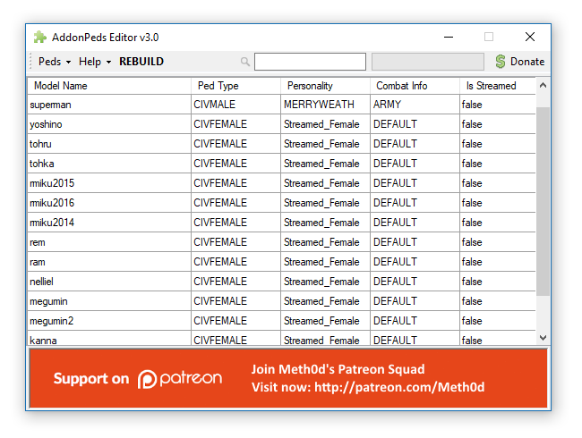

# GTA5 WaifuGuards


> Anime girls as your body guards in GTA5 game

## How to spawn a Ped

```vbnet
Dim waifu As Ped = World.CreatePed(New Model(name), pos)
```

For create a ped, the ``World.CreatePed`` function required at least two parameter value: ped's model and its location in the game world. Where the peds' model can be constructed from the model name, and this model name can be customized model which is imported by using ``AddonPeds Editor`` GTAV mod.


> You can using the ``AddonPeds Editor`` for imports your custom player skin as your waifu guards model.

So, if you want spawn a **2016ver Racing Miku**, then you can using the code like:

```vbnet
Dim miku2016 As Ped = World.CreatePed(New Model("miku2016"), pos)
```

A miku will but created and positioning to a given location.